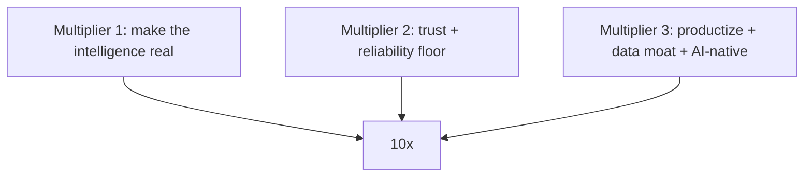

# The 10x Plan

> Supersedes `docs/roadmap-scale-1m-to-10m.md` (parked before the Infinity merge).
> Status: planned. Recall with "execute the 10x plan" and we start at Multiplier 1.

## Where we are after the merge

The app is no longer a single-feature prototype — it's a full window-install operating system: install brain (fit/condition gate, briefing, capture, AI tips/how-to), crew dispatch + My Work, learning flywheel (rollups, learned dispatch, prediction, analytics), training + clearance + education/glossary with spaced repetition, time clock/payroll, job costing/margin + bid calculator, points/gamification, safety/tools/supplies, QC sign-off, and a role model (installer/foreman/admin/Big Boss).

10x is no longer "more modules." It is three multipliers:

## Multiplier 1 — Make the intelligence real (finish the flywheel)
Carried from the parked scale roadmap; the merge did the modules, not the smarts.
- Next-skill recommender: route apprentices to the type they're closest to clearing so training manufactures routable capacity.
- Continuous re-dispatch + pace-vs-target: rebalance the day live using proven per-installer speed; nudge ahead/behind forecast.
- Zero-rework upstream: push the fit/condition gate to load-out (block loading a misfit/damaged unit); route rework-prone types to proven-clean installers using QC callback data.
- Bidding maturity: CAD-driven bid estimator (schedule vs install history), confidence bands from variance, win/loss + margin tracking (job costing is already in).
- Mine the dead signals: movement dwell time, transcript search across a type, photo_findings defect patterns.

## Multiplier 2 — Trust + reliability floor (the gate to scale)
- AI reliability: an `ai_jobs` queue + retry/backoff + budget guard + graceful fallback so transcription/tips/how-to never silently die (today they 429). Surface AI health.
- Tenancy + real RLS: `company_id` on core tables + role-scoped policies (RLS is wide open today). This is the prerequisite for more than one company.
- CI + integration tests: GitHub Actions (lint/test/build) + first RPC/offline integration tests.
- Real data: real ~100-type catalog, real planset parsing + DWG conversion (still stubbed).

## Multiplier 3 — The actual 10x
- Productize to multi-tenant SaaS: same code, per-company isolation, seats/billing — sell to other window & door companies. 10x of value created, not just internal efficiency.
- Data network effect: anonymized cross-company benchmarks ("industry par time for this type is 42m; your crew runs 55m") — a moat no single shop can build.
- AI-native install assistant: real-time vision QA (check the shim gap / flashing from the photo before submit), predictive defect prevention, and ask-in-the-ear Q&A on the company brain.

## Sequencing
1. Multiplier 1 (finish intelligence) + the AI-reliability + CI pieces of Multiplier 2 — makes the single-company tool smart and bulletproof.
2. Multi-job command board + bidding maturity — run 10x volume in your own business.
3. Tenancy -> SaaS -> data network effect -> AI-native — 10x the software itself.

All work continues on `cursor/window-ops-100x-upgrade-014b`; production items are written to be promoted, not thrown away.
