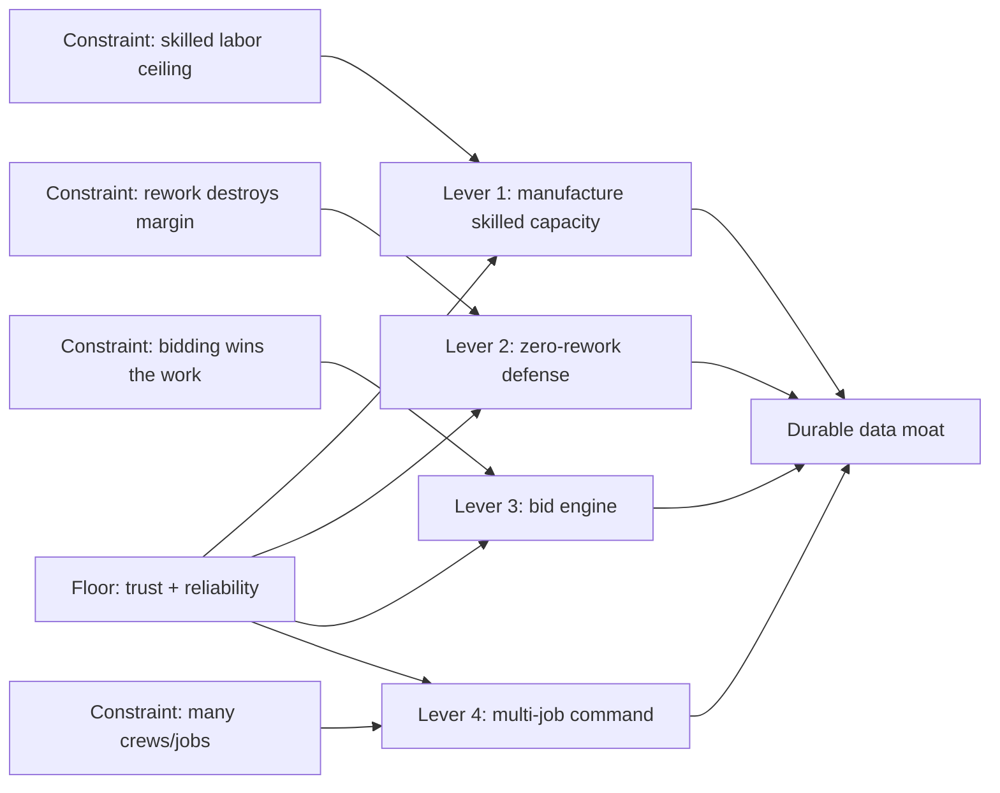

# Roadmap: Scaling $1M → $10M/year

> Saved growth roadmap. When ready to build, say "execute the scale roadmap" and we start at Lever 1.
> Status: planned (not yet executed). Execution stays prototype; architecture is written to be promoted to production later.

## Scaling theory

The software's only job is to remove the constraints that cap a window-install business. Revenue does not scale by adding features; it scales by lifting four ceilings. Our existing strengths map onto them, and our weaknesses are exactly what cracks at 10x.

Tags: `[P]` = prototype now, `[Prod]` = architect now, promote later.

## Lever 1 — Manufacture skilled capacity (biggest revenue lever)

Strength upgraded: training → clearance → learned dispatch (`app/src/lib/dispatch.ts`, `app/src/pages/Training.tsx`).

- `[P]` **Next-skill recommender:** route apprentices to the types they are closest to clearing (near `CLEAR_MIN_INSTALLS`/grade) so they cross the threshold and become routable capacity — the app literally grows your labor pool.
- `[P]` **Continuous re-dispatch:** rebalance remaining openings across the crew as the day progresses (not one-shot), using proven speed from `installer_type_stats`.
- `[P]` **Pace-vs-target nudge** on My Work and Dispatch (ahead/behind the forecast).
- `[Prod]` Crew capacity planning across scheduled jobs.

## Lever 2 — Zero-rework at volume (margin defense)

Strength upgraded + weakness defended: fit/condition gate (`app/src/lib/install/fit.ts`).

- `[P]` **Push the gate upstream to load-out:** block loading a unit onto the truck when RO says it won't fit or the unit is damaged (today it only fires on-site in `app/src/pages/install/OpeningSheet.tsx`).
- `[P]` **Defect/callback rate** per type + per installer; route rework-prone types to proven-clean installers (feed into dispatch ranking).
- `[P]` **Mine `install_events.photo_findings`** for recurring defect patterns; surface as watch-outs and a post-install QA checklist.
- `[Prod]` Warranty/callback ticket loop.

## Lever 3 — Bid engine (win more, lose less)

Strength upgraded: prediction (`app/src/lib/estimate.ts`).

- `[P]` Evolve estimate into a real bid model: travel/setup/teardown constants, crew-mix-aware duration (fast installers finish faster), confidence bands from historical variance.
- `[P]` **Bid screen:** labor hours + cost + risk band per job; persist and track estimate-vs-actual and margin over time in Analytics (`app/src/pages/Analytics.tsx`).
- `[Prod]` CRM/quote + win-loss integration.

## Lever 4 — Multi-job / multi-crew command (org scale)

Weakness defended: coordination is per-job today.

- `[P]` **Company "today" board:** every active job, crew, live pace, and blockers in one lead view; cross-job unit + crew allocation.
- `[Prod]` Region/branch rollups and scheduling.

## Lever 5 — Trust + tenancy (production floor, modeled now)

Weakness defended: RLS is wide open, single-company (`supabase/migrations`).

- `[Prod]` Introduce `company_id` + role-scoped RLS policies designed now (written and tested behind a flag in the prototype), so the multi-tenant boundary exists before real customers.
- `[Prod]` Keep the lead-only guards already added (`set_profile_role`, `set_clearance`) as the pattern.

## Lever 6 — AI reliability + data trust (the brain must never die)

Weakness defended: OpenAI 429 / silent failure; seeded data.

- `[P]` **AI job queue** (`ai_jobs` table) + retry/backoff + budget guardrail + graceful fallback in `supabase/functions/_shared/openai.ts` and the three functions, so transcription/tips/how-to never silently vanish; surface AI health.
- `[P]` Real planset fixtures for the parser (`app/src/lib/install/extract.ts`); begin the DWG conversion path design (still stubbed today).
- `[Prod]` Cost controls, model routing, observability.

## Lever 7 — Durable data moat

Strength upgraded: proprietary per-type/per-installer learning.

- `[P]` Mine currently-dead signals: movement dwell time (`scripts/weekly-report.mjs` logic into the app), transcript search across a type, versioned + exportable rollups.
- `[Prod]` Anonymized cross-company benchmarks as a future product.

## Enabler — CI + integration tests

- `[P]` GitHub Actions (lint/test/build) + first integration tests for RPCs and the offline queue (only pure-logic units exist today). De-risks the eventual production push. Note: this reopens the earlier "skip CI" prototype decision on purpose, because we are now planning for production.

## Sequencing

1. **Levers 1 + 2** (throughput + rework) — the direct revenue/margin levers.
2. **Lever 3** (bid engine) — wins the volume.
3. **Lever 4** (multi-job command) — runs the volume.
4. **Levers 5/6/7 + CI** — the production floor, modeled during the above.

All work continues on `cursor/window-ops-100x-upgrade-014b`; production items are written to be promoted, not thrown away.
